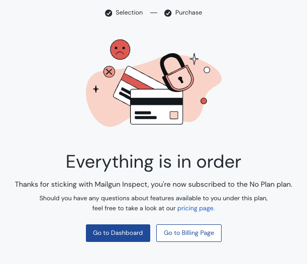

[Invoice arrives in inbox]

Damn, I forgot we wrapped up testing on that service, I should cancel the subscription.

Let me jump into the account real quick, have a quick scan of the options.

_Manage account_. Seems right, lets go there.

Hm. The only option seems to be _Plan downgrade/close account_ with a big red _Close my account_ button.

Nope, that can't be right. Let's keep looking.

_Plan & Billing_! Ah of course, that's where it'll be.

Hm. The product only has a blue _Upgrade_ button...

There is a small three dot button next to that, I wonder what's in there.

_Unsubscribe_? Okay, I guess that sounds like what I'm wanting to do here.

Why am I on a purchase page with a $0 cost?

Fine, I'll press whatever. Please let this be done, I have other things to be doing with my life.

...

CONGRATULATIONS YOU HAVE PURCHASED YOUR UNSUBSCRIBE.

(RED SAD FACE) EVERYTHING IS IN ORDER.

THANKS FOR STICKING WITH US, YOU'RE ON THE NO PLAN PLAN.

IF YOU HAVE ANY MORE QUESTIONS ABOUT YOUR NO PLAN PLAN, LOOK AT PRICING.

(╯°□°)╯︵ ┻━┻
